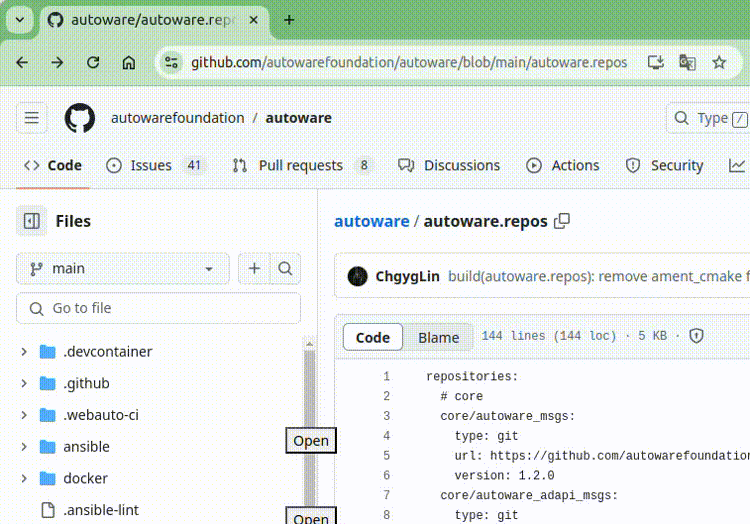

# vcstool repos shortcut chrome extension

A Chrome extension that adds a shortcut button to open the URLs of repositories listed in the repos file.

## Features

- 🚀 Automatically detects `.repos` files on GitHub
- 🎯 Adds convenient "Open" buttons next to each repository entry
- 🔗 Supports both SSH and HTTPS repository URLs
- 📦 Handles version/branch/commit navigation
- ⚡ Real-time URL monitoring with GitHub SPA navigation

## Installation

### From the Chrome Web Store

[Chrome Web Store](https://chromewebstore.google.com/detail/vcstool-repos-shortcut-ex/pphgbpclcbjlfhbkkpenkcljjkdggmnp)

### From Source Code

1. Clone or download this repository
2. Open Chrome and navigate to `chrome://extensions/`
3. Enable "Developer mode" in the top right
4. Click "Load unpacked" and select this directory

## Development

### Project Structure

```
├── background.js      # Background script for URL monitoring
├── main.js           # Content script for UI manipulation
├── manifest.json     # Extension manifest
├── package.json      # Project metadata
└── images/          # Extension icons and demo assets
```

### Architecture

The extension is built with a modular architecture:

- **NavigationHandler** (background.js): Monitors GitHub URL changes
- **UrlUtils**: Utility functions for URL processing
- **RepositoryParser**: Parses .repos file content
- **UIManager**: Handles button creation and placement
- **VCSToolsExtension**: Main application class

### Code Quality

- ✅ Modular ES6 class-based architecture
- ✅ Comprehensive JSDoc documentation
- ✅ Consistent error handling and logging
- ✅ Debounced event listeners for performance
- ✅ Secure button creation with proper attributes

## Demo



## License

MIT License - see [LICENSE](LICENSE) file for details

## Contributing

1. Fork the repository
2. Create your feature branch
3. Make your changes with proper documentation
4. Test the extension thoroughly
5. Submit a pull request

## Changelog

### v0.2.0

- Complete code refactoring with modular architecture
- Improved error handling and logging
- Enhanced button styling and accessibility
- Better performance with debounced events
- Comprehensive documentation

### v0.1.0

- Initial release
- Basic repository URL detection
- Simple button placement
